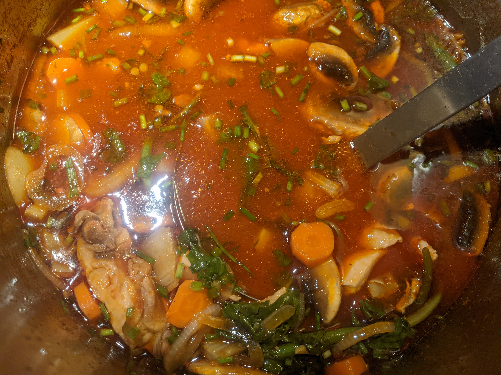

I used [this recipe](https://futuredish.com/gochujang-jjigae-use-up-your-tub-of-gochujang) as a starting point, and inspired by [another, somewhat simpler recipe](http://crazykoreancooking.com/recipe/red-chili-paste-stew-tuna-chamchi-gochujang-jjigae), I used 2 cans of tuna, some zucchini, mushrooms, frozen spinach, and potato gnocchi.

#### Prep

- Cut green onions into small circles.
- Thinly slice the onion, potato, chili peppers, and the mushrooms.
- If using meat, slice it thinly.

#### Cooking

- Stir fry the gochujang in both oils (on low heat). Add the gochugaru and water (or stock). Crank up the heat, and bring it to a boil.

- Add
  - protein
  - potato
  - garlic
  - soy sauce
  - fish sauce

- Boil for 5 minutes, until the potatoes start to soften.

- Add
  - onion
  - mushrooms
  - chili pepper(s) (if desired)

- Cook until the potatoes are done (another 7-10 minutes).

- Add some of the green onion (reserving the rest for a garnish), and finish off with the black pepper.

- Let it rest for 10 minutes, then adjust the seasoning as desired. There's plenty of salt in some of the ingredients, so it shouldn't need any. If anything, you may want to dilute the soup to reduce the saltiness.

Here's the first batch, in which I used chicken thighs and carrots. You can see from color of the later batch pictured above that I've learned to reduce the intensity of the broth.

